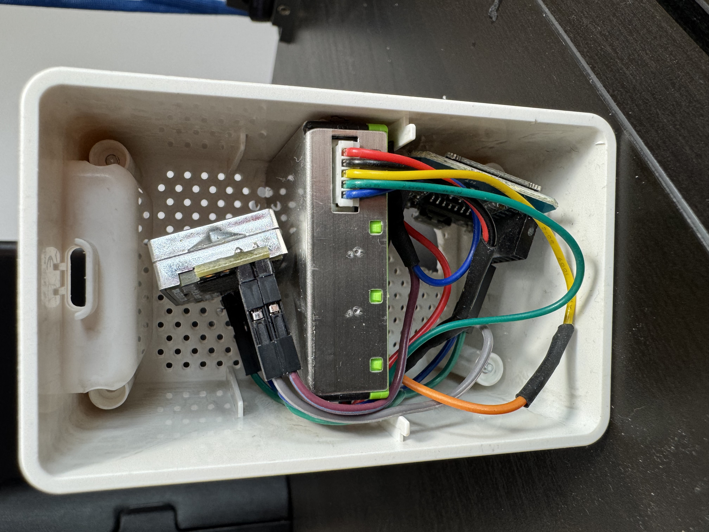

# air-quality-sensor

DIY Air Quality Sensor

As my air purifiers do a decent job at cleaning the air but have poor sensors,  
I decided to build my own sensors and control the air purifiers using [Home Assistant](https://www.home-assistant.io/).

## Sensors

I used the [Sensirion SPS30](https://sensirion.com/products/catalog/SPS30) to measure particulate matter levels. It's a well-designed sensor with great stability over time.

For CO2 measurements, I used the [SenseAir S8](https://senseair.com/product/s8/).

Both sensors are controlled using a Wemos D1 Mini Pro and [ESPHome](https://esphome.io/), as it is the most Home Assistant-native solution.

## Complete Assembly

To house these components, I used an [IKEA Vindriktning](https://www.ikea.com/us/en/p/vindriktning-air-quality-sensor-60515911/) sensor case, removed its internal parts, and installed custom components with the help of a Dremel rotary tool:
